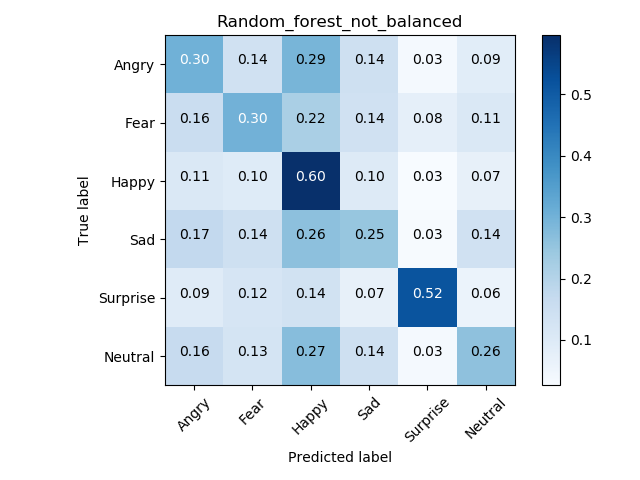
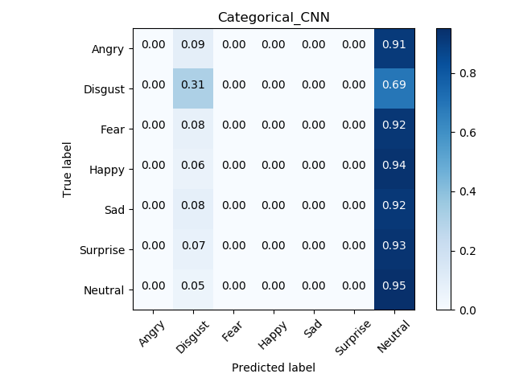
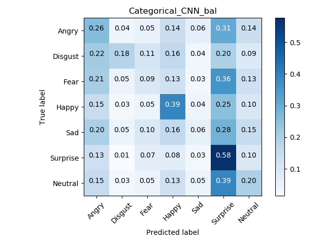

# Emotional Face Classification

By Danny Lumian, PhD

Winter, 2018

# Motivation

Understanding emotions is crucial for navigating our complex, social world.

Faces are rich sources of emotional and non-verbal emotional information. 

Many of us excel at rapidly interpreting and aggreating such information.

However, sometimes it may be useful to augment or quantify such information. 

This project is aimed are providing such information for images and (eventually) videos. 

While emotion space can be conceptualized in several ways, one useful model is to break emotions into discrete categories.

This model will examine 6 'basic' emotion categories: 

    0:'Angry'
    1:'Fear'
    2:'Happy'
    3:'Sad'
    4:'Surprise'
    5:'Neutral'

*Note: The original dataset also contained disgust faces,
however these were dropped due to a low number of sample images* 

Example Emotional Expressions : 

# Data: FER2013

https://www.kaggle.com/c/challenges-in-representation-learning-facial-expression-recognition-challenge/data

|    | Label    |   # train |   # bal train |   # validation |   # test |
|---:|:---------|----------:|--------------:|---------------:|---------:|
|  0 | Angry    |      3995 |          3171 |            467 |      491 |
|  1 | Fear     |      4097 |          3171 |            496 |      528 |
|  2 | Happy    |      7215 |          3171 |            895 |      879 |
|  3 | Sad      |      4830 |          3171 |            653 |      594 |
|  4 | Surprise |      3171 |          3171 |            415 |      416 |
|  5 | Neutral  |      4965 |          3171 |            607 |      626 |


*Note: Disgust faces were dropped due to a low number (~500) of sample images* 


# Data Exploration and Reduction

## PCA

Average faces by category: 


Example faces with [1, 3, 5, 10] components:


## NMF 

Example faces with [1, 3, 5, 10] components:


# Models

## Model Comparison

| Model         |   Balanced |   Train Log Loss |   Test Log Loss |   Train Accuracy |   Test Accuracy |
|:--------------|-----------:|-----------------:|----------------:|-----------------:|----------------:|
| MNB           |          1 |           25.684 |          25.73  |            0.249 |           0.25  |
| MNB           |          0 |           25.549 |          25.661 |            0.254 |           0.252 |
| Random_forest |          1 |            0.337 |           5.225 |            0.991 |           0.327 |
| Random_forest |          0 |            0.331 |           4.733 |            0.991 |           0.374 |
| CNN_cat       |          0 |           13.109 |          19.494 |            0.604 |           0.423 |
| CNN_cat_bal   |          1 |           14.909 |          20.532 |            0.555 |           0.395 |
| CNN_cont      |          0 |           15.474 |          20.373 |            0.534 |           0.395 |
| CNN_cont_bal  |          1 |           12.6   |          20.148 |            0.623 |           0.406 |


### Models Using Leaky Relu (compared to Relu)

| Model              |   Balanced |   Train Log Loss |   Test Log Loss |   Train Accuracy |   Test Accuracy |
|:-------------------|-----------:|-----------------:|----------------:|-----------------:|----------------:|
| MNB                |          1 |           25.684 |          25.73  |            0.249 |           0.25  |
| MNB                |          0 |           25.549 |          25.661 |            0.254 |           0.252 |
| Random_forest      |          1 |            0.337 |           5.225 |            0.991 |           0.327 |
| Random_forest      |          0 |            0.331 |           4.733 |            0.991 |           0.374 |
| CNN_cat_leaky      |          0 |            9.966 |          18.998 |            0.698 |           0.437 |
| CNN_cat_bal_leaky  |          1 |           10.262 |          20.039 |            0.689 |           0.407 |
| CNN_cont_leaky     |          0 |           10.798 |          18.471 |            0.679 |           0.458 |
| CNN_cont_bal_leaky |          1 |           10.822 |          19.85  |            0.671 |           0.41  |


## Multinomial Naive Bayes

1. Vanilla (no parameters specified)
1. Good baseline model
1. 2-D images projected as 1-D arrays

### MNB


### MNB-Balanced


## Random Forest

1. 100 trees
1. 2-D images projected as 1-D arrays
1. No pruning

### RF



### RF-Balanced


## Convolutional Neural Network (CNN)

1. Compared continuous (ints) and categorical (OHE) target arrays

    + categorical_crossentropy (categorical)
    + sparse_categorical_crossentropy (continuous)

1. Batch size = 128
1. Epochs = 10
1. Steps_per_epoch = 50 
1. Used same model architecture for all 

```python
    nb_filters = 48
    kernel_size = (3, 3)
    pool_size = (2, 2)

    model = Sequential()
    # 2 convolutional layers followed by a pooling layer followed by dropout
    model.add(Convolution2D(nb_filters, kernel_size,
                            padding='valid',
                            input_shape=input_size))
    model.add(Activation('relu'))
    model.add(Convolution2D(nb_filters, kernel_size))
    model.add(Activation('relu'))
    model.add(MaxPooling2D(pool_size=pool_size))
    model.add(Dropout(0.25))
    # transition to an mlp
    model.add(Flatten())
    model.add(Dense(128))
    model.add(Activation('relu'))
    model.add(Dropout(0.5))
    model.add(Dense(n_categories))
    model.add(Activation('softmax'))
    return model
```

### Continuous CNN


### Continuous CNN-Balanced


### Categorical CNN



### Categorical CNN-Balanced



# Conclusions

1. Best model (to date) is Random Forest (with all data) with approx 40% accuracy 
1. Imbalanced data can cause problems
1. Important to check impact of parameters (i.e., class_weights)

# Future Directions

1. Improve model performance
1. Revisit preprocessing and image generation
1. Figure out weighting to utilize full training dataset
1. Image parsing to feed in new images, detect faces and categorize

